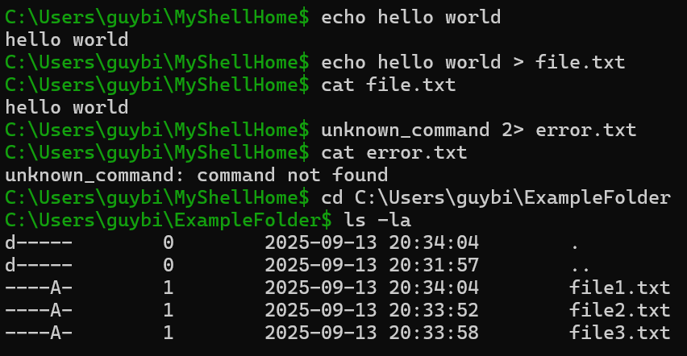

# Interactive Shell

A lightweight interactive shell implemented in **C++**. This project aims to demonstrate how a basic interactive shell works — parsing input, executing simple commands, and handling basic output redirection. The project is a work in progress and intended for learning and experimentation.

---

## Quick summary
- **Language:** C++ (C++20)
- **Status:** Work in progress — core features implemented but several limitations/bugs remain.
- **Supported built-ins:** `echo`, `cat`, `cd`, `ls`, `help`
- **Redirection:** Output redirection (`>`/`1>`) and error redirection (`2>`) supported . Input redirection (`<`) and pipes (`|`) are **not** implemented yet.

---

## Features
- Interactive prompt with command parsing.
- Built-in commands: `echo`, `cat`, `cd`, `ls`, `help`.
- Simple output redirection using `>` (overwrites target file).
- Maintains a persistent working directory for the session.

---

## Installation

**Requirements**
- A C++ compiler with C++20 support (e.g., `g++`, `clang++`).
- `make` (optional, if a `Makefile` is present).

**Build using make** (recommended if a Makefile is provided):

```bash
git clone https://github.com/guybiran123/Interactive-Shell.git
cd Interactive-Shell
make
# resulting binary: ./interactive-shell
```

**Build manually** (example):

```bash
g++ -std=c++20 -O2 -Wall -o interactive-shell src/*.cpp
```

Adjust the `src/*.cpp` to match your source layout.

---

## Usage

Start the shell from the project directory (or any folder):



### Output redirection examples
Write text to a file (overwrites if exists):

```
> echo hello > output.txt
> cat output.txt
hello
```

Redirecting a command's stdout into a file in the current working directory.

---

## Supported commands (reference)

- `echo [args..]` — prints its arguments to stdout.
- `cat <file>` — prints the contents of `<file>` to stdout.
- `cd [dir]` — change current working directory. `cd` with no args goes to the user's HOME.
- `ls [path]` — list files of `path` (or `.` if omitted).
- `help` — display available commands and short usage info.

---

  - **Workarounds:**
    - Use an explicit relative path that clarifies you mean the current directory: `> ./newfile.txt`.
    - Use an absolute path: `> /home/user/some/subdir/newfile.txt`.
    - `cd` to the desired directory before running the redirect (and prefer providing a full path to the redirected file).

- **No input redirection or piping:** `<` and `|` are not supported yet.
- **Limited parsing:** The command parser is simple — advanced quoting, escaping, and complex command lines might not behave exactly like a POSIX shell.
- **No job control:** Background jobs (`&`) and job management are not implemented.
- **Platform:**  The shell simulates Linux commands, but the program itself is built for Windows. Running on Unix/Linux is not supported.

---